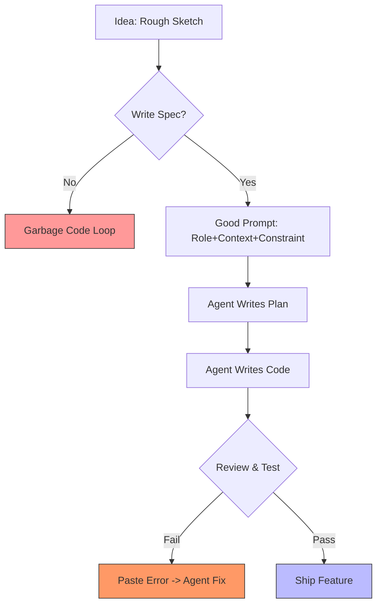

# 🗺️ The Cheatsheet: Weekend-to-Release (AI Edition)

### The 2-Page "Ultimate Guide" for Shipping with Agents
This is the distilled version of the entire course. Use this as your roadmap.

---

## 📄 Page 1: The AI Dev Loop (80%)

### 1. 🤖 The Agent Setup
**Goal:** Your AI is the Senior Dev. You are the Architect.

### 2. 📝 The Golden Prompt Formula
**Context + Action + Output Format**

> **Bad:** "Make a landing page."
> **Good:** "Context: We are building a portfolio for a designer. Action: Create `index.html` with a hero section, grid gallery, and contact form. Use TailwindCSS. Output: Only the code for `index.html`."

### 3. 🧠 Context Management
**Rule of Thumb:**
- **Start Fresh:** Reset context every major feature.
- **Reference:** Point to existing files (`@src/utils.ts`) instead of pasting entire repo.
- **Docs:** Keep a `tech_stack.md` or `.cursorrules` to ground the AI.

---

## 📄 Page 2: The Release Rocket (20%)

### 4. 📦 The Package & Config
**Goal:** "It works on my machine" -> "It works on yours."

- **Must Have:**
  - ✅ `README.md` (What is this?)
  - ✅ `INSTALL.md` (How to run it?)
  - ✅ `.env.example` (Config structure)

### 5. 🏷️ Versioning & Changelog
**Goal:** Communicate changes clearly.

| Version | Meaning | Example |
| :--- | :--- | :--- |
| **Major** | Breaking changes. | `1.0.0` -> `2.0.0` |
| **Minor** | New features (safe). | `1.1.0` -> `1.2.0` |
| **Patch** | Bug fixes (safe). | `1.1.1` -> `1.1.2` |

**The Changelog Rule:**
- **Added:** New features.
- **Fixed:** Bug fixes.
- **Changed:** Existing behavior changes.

### 6. 🚀 The Launch Checklist
- [ ] **Repo:** Public, clean history.
- [ ] **Readme:** Screenshot at the top.
- [ ] **Install:** Verified on a *clean* machine.
- [ ] **Release:** Tagged `v1.0.0` with notes.
- [ ] **Social:** Meaningful announcement (Problem -> Solution -> Link).

---

Print this or keep it open while you build. This is the path to shipping.

