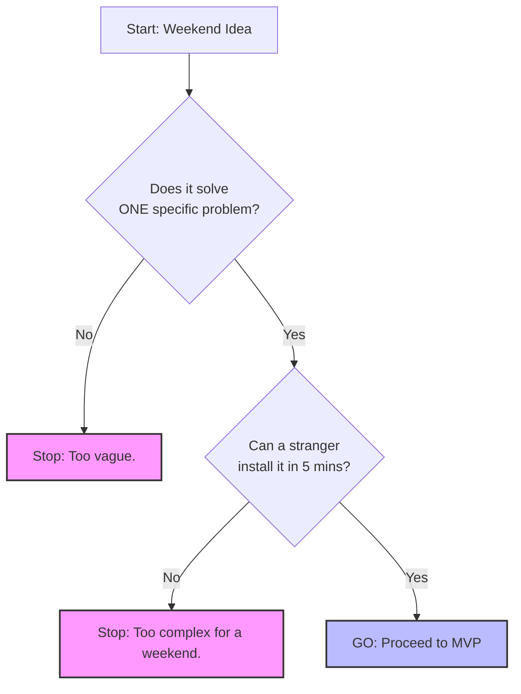
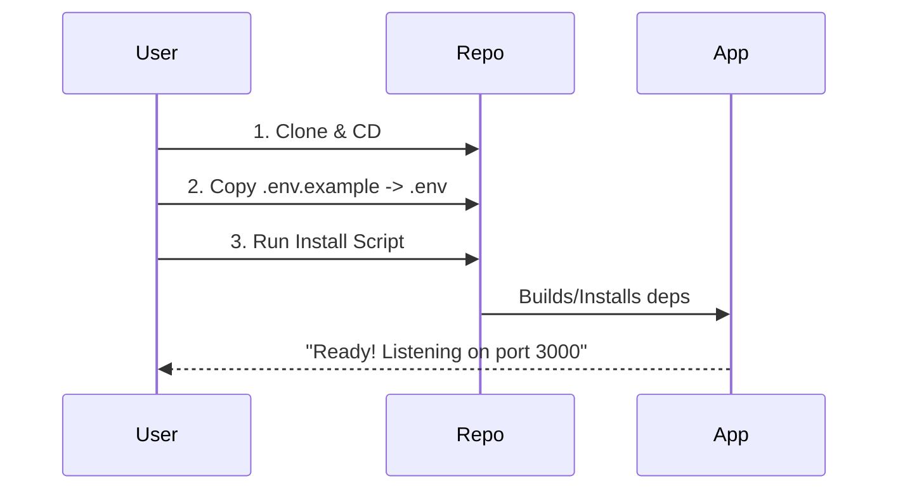

# 🗺️ The Cheatsheet: Weekend-to-Release

### The 2-Page "Ultimate Guide" for Shipping
This is the distilled version of the entire course. Use this as your roadmap.

---

## 📄 Page 1: The Build Plan

### 1. 🚦 The Idea Filter
**Goal:** Don't build what you can't ship in a weekend.



### 2. ✂️ The MVP Cut
**Goal:** The smallest *installable* value.

- **Must Have:**
  - ✅ Core function (it does the thing).
  - ✅ Install script (one command).
  - ✅ Basic Readme.
- **Cut Ruthlessly:**
  - ❌ User accounts/Auth (unless critical).
  - ❌ Cloud sync.
  - ❌ Custom themes.
  - ❌ Analytics.

### 3. 📦 The Package & Config
**Goal:** "It works on my machine" -> "It works on yours."



---

## 📄 Page 2: The Release Rocket

### 4. 🏷️ Versioning & Changelog
**Goal:** Communicate changes clearly.

| Version | Meaning | Example |
| :--- | :--- | :--- |
| **Major** | Breaking changes. | `1.0.0` -> `2.0.0` |
| **Minor** | New features (safe). | `1.1.0` -> `1.2.0` |
| **Patch** | Bug fixes (safe). | `1.1.1` -> `1.1.2` |

**The Changelog Rule:**
- **Added:** New features.
- **Fixed:** Bug fixes.
- **Changed:** Existing behavior changes.

### 5. 🛡️ The Support Shield
**Goal:** Help users help themselves.

```mermaid
flowchart LR
    A[User Has Issue] --> B{Is it in README?}
    B -- Yes --> C[Point to Docs]
    B -- No --> D{Is it a bug?}
    D -- Yes --> E[Fix in 'next' branch]
    D -- No --> F[Feature Request (Maybe Later)]
    
    style C fill:#9f9,stroke:#333
    style E fill:#f96,stroke:#333
```

### 6. 🚀 The Launch Checklist
- [ ] **Repo:** Public, clean history.
- [ ] **Readme:** Screenshot at the top.
- [ ] **Install:** Verified on a *clean* machine.
- [ ] **Release:** Tagged `v1.0.0` with notes.
- [ ] **Social:** Meaningful announcement (Problem -> Solution -> Link).

---

<div align="center">
<sub>Print this or keep it open while you build. This is the path to shipping.</sub>
</div>
