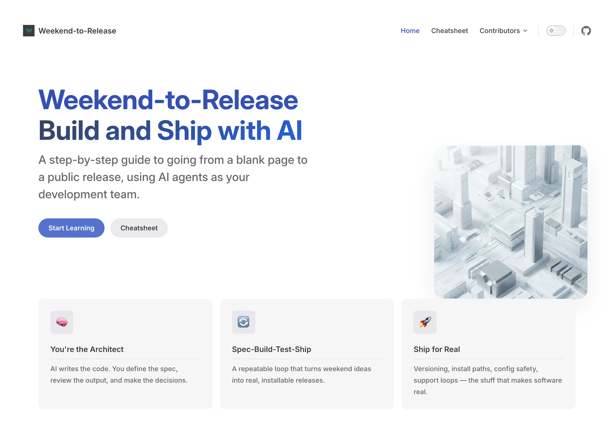
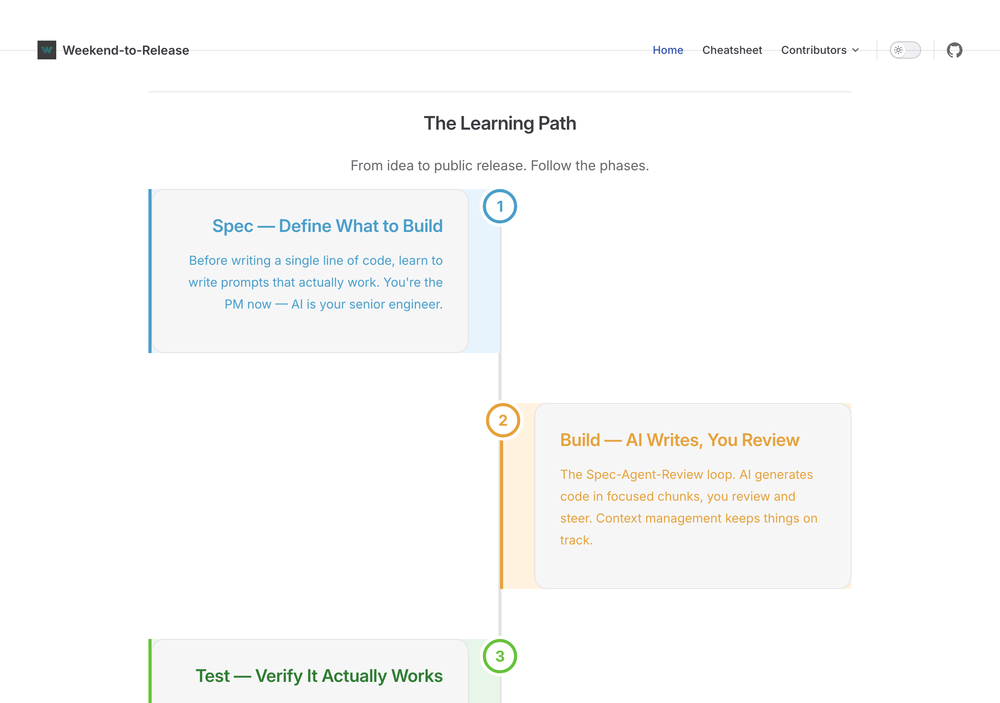
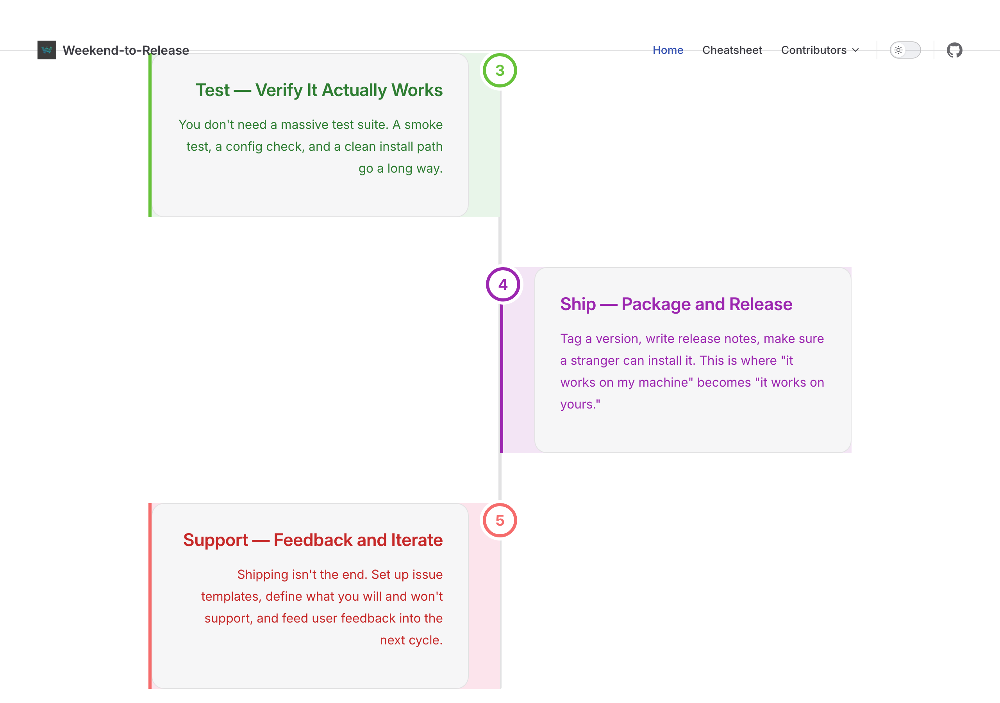
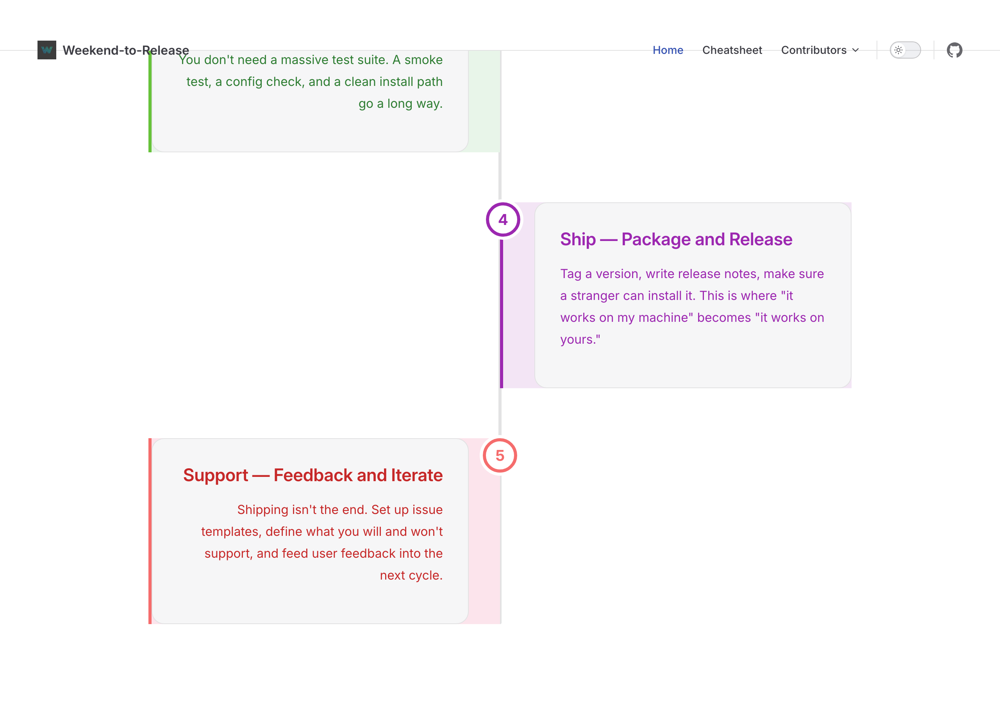

## For Students

**Start learning now:** [parkwardrr.github.io/weekend-to-release](https://parkwardrr.github.io/weekend-to-release/)

### Table of Contents

- [What You'll Learn](#what-youll-learn)
- [Learn from the Pros](#learn-from-the-pros)
- [For Contributors (Pros)](#for-contributors-pros)
- [Building & Publishing](#building--publishing)
- [Project Structure](#project-structure)

---

<div align="center">



# Weekend-to-Release

[](https://parkwardrr.github.io/weekend-to-release/)
[](https://parkwardrr.github.io/weekend-to-release/)

[](https://vitepress.dev/)
[](https://mermaid.js.org/)
[](https://nodejs.org/)
[](./LICENSE.md)
[](./CONTRIBUTING.md)
[](https://github.com/ParkWardRR/weekend-to-release/graphs/contributors)
[](https://github.com/ParkWardRR/weekend-to-release/commits/main)
[](https://github.com/ParkWardRR/weekend-to-release)
[](https://github.com/ParkWardRR/weekend-to-release/stargazers)

**A practical guide to building and shipping with AI agents.**
Learn the AI-led Product Development Life Cycle (PDLC) from experienced developers who share their real workflows, tips, and hard-won knowledge.

</div>

The site walks you through the full AI-led PDLC — from blank page to public release:



### What You'll Learn

| Phase | What It Covers |
|-------|---------------|
| **Spec** | Define what to build with AI-assisted brainstorming |
| **Build** | Agentic coding, prompt engineering, context management |
| **Test** | AI-collaborative debugging and testing strategies |
| **Ship** | Distribution, versioning, config & safety |
| **Support** | Feedback loops, roadmap, iteration |



### Learn from the Pros

Real developers share their workflows and hard-won knowledge. Each pro's content is organized into a **curriculum overview**, **full course**, and **quick-reference cheatsheet**.



---

## For Contributors (Pros)

[](./CONTRIBUTING.md)
[](https://github.com/ParkWardRR/weekend-to-release/graphs/contributors)

Share what you know. Write messy — the pipeline handles formatting.

```
contributors/your-name/        ← Drop .md files here
        ↓
tools/generate_curriculum.js    ← Pipeline organizes & structures
        ↓
learn/your-name/                ← Curriculum, course, cheatsheet
```

### Quick Start

```bash
# 1. Fork & clone
git clone https://github.com/ParkWardRR/weekend-to-release.git
cd weekend-to-release

# 2. Create your folder and dump your knowledge
mkdir contributors/your-name
# Drop any .md files — tips, workflows, war stories, whatever

# 3. Generate your pages
npm install
npm run generate:curriculum

# 4. Review output in learn/your-name/
# 5. Open a PR
```

See [CONTRIBUTING.md](./CONTRIBUTING.md) for full details.

---

## Building & Publishing

[](https://vitepress.dev/)
[](https://mermaid.js.org/)
[](https://playwright.dev/)

### Setup

```bash
git clone https://github.com/ParkWardRR/weekend-to-release.git
cd weekend-to-release
npm install
```

### Generate + Dev Server

```bash
npm run generate:curriculum    # turns contributor notes into structured pages
npm run docs:dev               # localhost:5173/weekend-to-release/
```

### Deploy to GitHub Pages

```bash
npm run docs:build
bash tools/deploy.sh
```

### Capture Screenshots

```bash
npx playwright install chromium
node tools/screenshots.js
```

See [docs/PIPELINE.md](./docs/PIPELINE.md) for the full pipeline reference.

---

<div align="center">

### Project Structure

```
weekend-to-release/
├── contributors/          ← Pro brain dumps (input)
│   ├── alex/
│   ├── antigravity/
│   └── claire/
├── learn/                 ← Generated per-pro pages (output)
│   ├── alex/
│   │   ├── index.md       ← Curriculum overview
│   │   ├── course.md      ← Full course
│   │   └── cheatsheet.md  ← Quick reference
│   └── ...
├── curriculum/            ← Primer modules (Phase 1–3)
├── tools/
│   ├── generate_curriculum.js
│   ├── screenshots.js
│   ├── deploy.sh
│   └── clean.sh
└── .vitepress/config.mts
```

[](./LICENSE.md)

</div>
