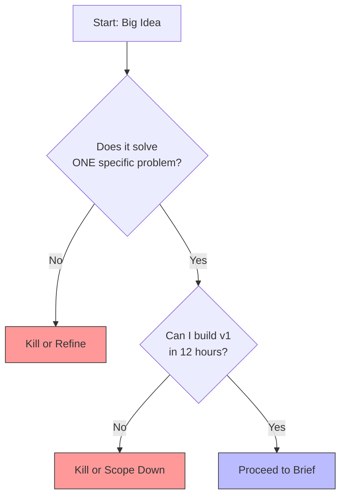

# Module A: The Weekend Idea Filter

> **Goal:** Go from "cool demo" to "shippable product brief".

Most weekend projects die because they are too vague. "I want to build a better Twitter" is a 6-month project. "I want to build a CLI that posts to Twitter from `stdin`" is a weekend project.

---

## 1. What You'll Build
A single-page **Product Brief** that defines exactly what you are building, who it is for, and—most importantly—what you are *not* building.

## 2. Why It Matters
Scope creep is the enemy of shipping. If you don't write down the boundaries now, you will invent new features on Saturday night instead of polishing the install process.

## 3. The Concept: The Idea Funnel

Start with your big idea, then apply filters until only the "weekend-sized" core remains.



## 4. Do This Now

Copy the template below into a new file called `PRODUCT_BRIEF.md` in your project root.

### The Product Brief Template

```markdown
# Product Brief: [Your Project Name]

## The Problem
[One sentence description of the pain point.]

## The Solution
[One sentence description of what this software does.]

## The User (Who cares?)
[Describe the person who will type `git clone`.]

## The "Weekend" Scope
- [ ] Feature 1 (Must have)
- [ ] Feature 2 (Must have)
- [ ] Feature 3 (Must have)

## The "Later" Scope (Do NOT build this weekend)
- User Accounts
- Cloud Sync
- Complex Analytics
```

## 5. Checklist

- [ ] Created `PRODUCT_BRIEF.md`.
- [ ] Filled out the "Problem" and "Solution".
- [ ] Listed exactly 3 "Must Have" features.
- [ ] Listed at least 3 things you will *not* build.
