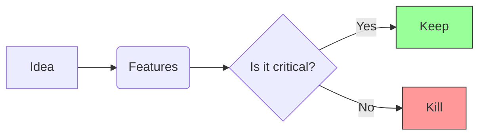

# Module B: MVP Scope

> **Goal:** Smallest. Installable. Value.

An MVP (Minimum Viable Product) is not a "lite" version of your grand vision. It is the absolute minimum you can release where the app *works* and *does something useful*.

---

## 1. What You'll Build
A checklist that separates "Must Have" from "Nice to Have". You will delete lines from your `PRODUCT_BRIEF.md`.

## 2. Why It Matters
If you don't cut features, you will have a broken app. If you cut features, you will ship a working, albeit simple, tool.

## 3. The Concept: The MVP Knife

What features are *required* for the user to solve their problem?



## 4. Do This Now

Look at your `PRODUCT_BRIEF.md`. Find the "Must Have" list and remove one item.

If you have 3 features:
1. Feature A (Core Function)
2. Feature B (Nice Add-on)
3. Feature C (Cool UI)

Cut B and C. If A still works, ship A.

### The MVP Checklist Template

Append this to your `PRODUCT_BRIEF.md`:

```markdown
## MVP (Minimum Viable Product)
- [ ] Core Logic (Does it work?)
- [ ] CLI / Interface (Can I run it?)
- [ ] Installation Guide (Can I install it?)
```

## 5. Checklist

- [ ] Removed all "Nice to Have" features from the MVP list.
- [ ] Confirmed the remaining feature(s) solve the core problem.
- [ ] Added "Installation Guide" as a feature (because it is one).
