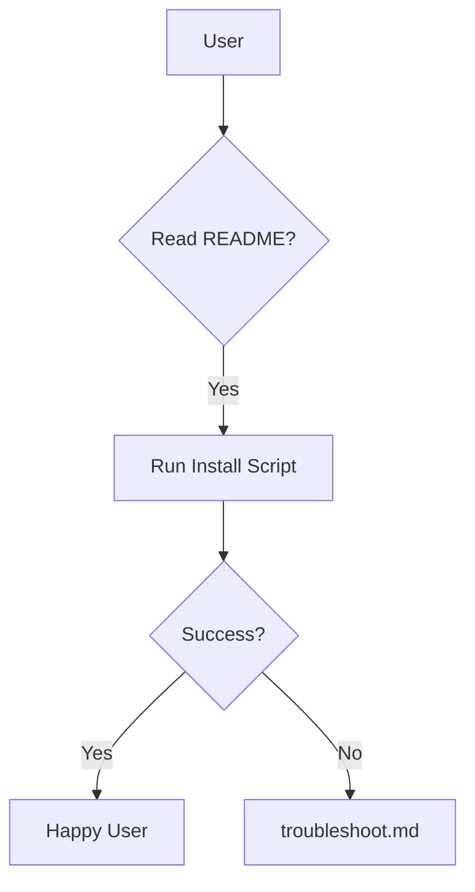

# Module C: Distribution & Install

> **Goal:** Create a foolproof install path anyone can follow.

Why installs fail (prereqs, permissions, ports, DNS, conflicts).

---

## 1. What You'll Build
Draft your `INSTALL.md` or installation section in README.

## 2. Why It Matters
Documentation and process save you from answering the same questions 100 times.

## 3. The Concept

## 4. Do This Now

Draft your `INSTALL.md` or installation section in README.

## 5. Checklist

- [ ] Created install script (or detailed steps).
- [ ] Verified on a clean machine (VM or container).
- [ ] Documented prerequisites.
