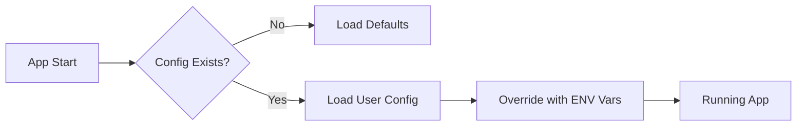

# Module D: Config & Safety

> **Goal:** Handle user settings and secrets without exposing them.

Safe defaults, clear config boundaries, secrets handling basics.

---

## 1. What You'll Build
Create a `config.example.json` or `.env.example`.

## 2. Why It Matters
Documentation and process save you from answering the same questions 100 times.

## 3. The Concept

## 4. Do This Now

Create a `config.example.json` or `.env.example`.

## 5. Checklist

- [ ] Identified all configuration options.
- [ ] Created example config file.
- [ ] Added `.env` to `.gitignore`.
