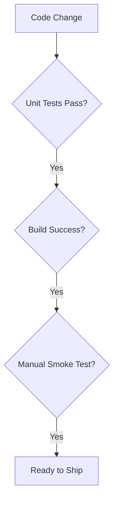

# Module E: Testing Strategy

> **Goal:** Verify your release without writing a massive test suite.

Smoke tests, acceptance checks, and reproducible bug reports.

---

## 1. What You'll Build
Write a `medical_check.sh` script or manual test plan.

## 2. Why It Matters
Documentation and process save you from answering the same questions 100 times.

## 3. The Concept

## 4. Do This Now

Write a `medical_check.sh` script or manual test plan.

## 5. Checklist

- [ ] Identified critical paths (login, main action).
- [ ] Created a manual test checklist.
- [ ] Automated at least one smoke test.
