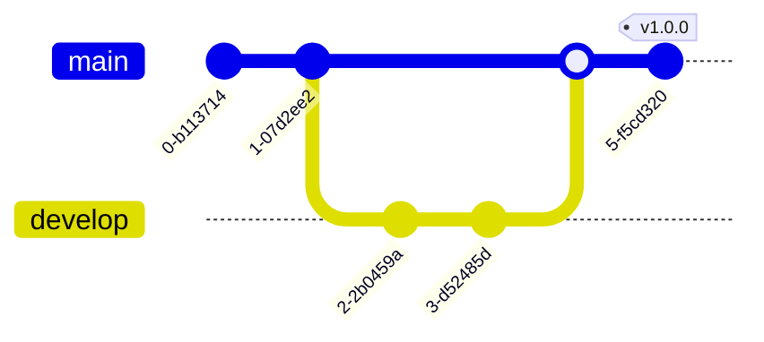

# Module F: Versioning & Upgrades

> **Goal:** Semantic versioning, changelogs, and upgrade paths.

Semantic-ish versioning (practical, not religious), changelog discipline.

---

## 1. What You'll Build
Draft your `CHANGELOG.md`.

## 2. Why It Matters
Documentation and process save you from answering the same questions 100 times.

## 3. The Concept

## 4. Do This Now

Draft your `CHANGELOG.md`.

## 5. Checklist

- [ ] Decided on versioning scheme (SemVer recommended).
- [ ] Created `CHANGELOG.md`.
- [ ] Tagged first release.
