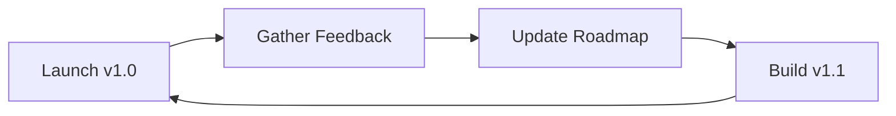

# Module H: Launch & Roadmap

> **Goal:** Ship, gather feedback, and plan the next version.

Shipping is a loop (release → feedback → next cut).

---

## 1. What You'll Build
Draft your `ROADMAP.md`.

## 2. Why It Matters
Documentation and process save you from answering the same questions 100 times.

## 3. The Concept

## 4. Do This Now

Draft your `ROADMAP.md`.

## 5. Checklist

- [ ] Updated `ROADMAP.md`.
- [ ] Announced release (Social/Email).
- [ ] Scheduled time for feedback review.
