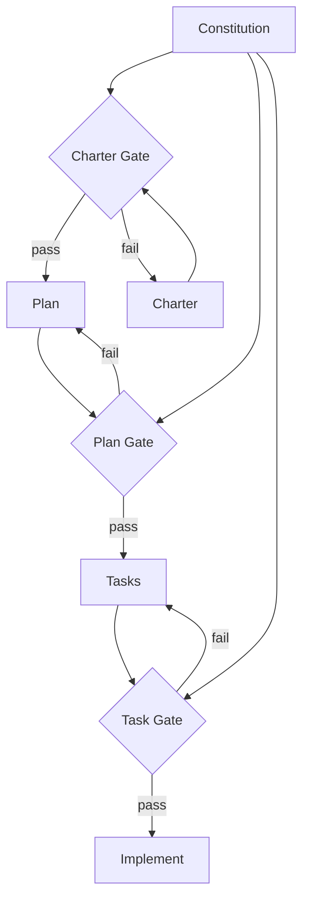

A project constitution is a set of governing principles that constrain all development decisions. Every charter, plan, task, and line of code must comply.

## Why You Need One

Without a constitution, AI agents make their own architectural decisions. They pick frameworks you did not ask for. They add abstractions you do not need. A constitution gives the agent explicit boundaries.

## The Default 9 Articles

Auro ships with 9 articles. Customize, remove, or add your own.

| # | Article | Rule |
|---|---------|------|
| I | Library-First | Prefer existing libraries over custom code |
| II | CLI Interface | All functionality accessible via CLI |
| III | Test-First | Write tests before implementation (NON-NEGOTIABLE) |
| IV | Integration Testing | Integration tests over unit tests |
| V | Observability | Structured, queryable logs for everything |
| VI | Versioning | Semantic versioning, no exceptions |
| VII | Simplicity | Simplest solution that meets requirements |
| VIII | Anti-Abstraction | No abstractions until 3+ concrete cases need them |
| IX | Integration-First | Build integration layer before business logic |

## Creating Your Constitution

```
/auro.constitution
```

The agent walks you through each article, asking whether to keep, modify, or remove it. The result saves to `.auro/constitution.md`.

## How It Flows Through Phases



At each gate, output is checked against the constitution. A charter violating Simplicity? Gate fails, revise the charter. A plan violating Library-First? Gate fails, revise the plan. Problems caught early, when they are cheap to fix.

## Customizing

Common modifications:

- **Remove CLI Interface** for pure library projects
- **Add a Security article** for user data handling
- **Add a Performance article** for latency requirements
- **Modify Test-First** to charter coverage thresholds

Edit `.auro/constitution.md` directly. All slash commands use the updated version.

## Next Steps

With your constitution in place, head to the [Charter phase](/weekend-to-release/charter/) to write structured charters. See [Principles](/weekend-to-release/principles/) for deep dives on each article.
