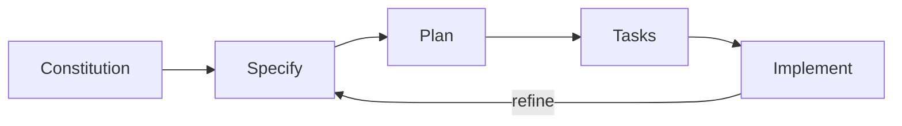

## Prerequisites

- **Python 3.11+** -- check with `python3 --version`
- **Git** -- check with `git --version`
- **Any AI coding agent** -- Claude Code, GitHub Copilot, Cursor, Windsurf, or any of the 15+ supported agents

## Installation

```bash
uv tool install specify-cli --from git+https://github.com/github/spec-kit.git
```

If you do not have `uv`:

```bash
curl -LsSf https://astral.sh/uv/install.sh | sh
```

Verify: `specify --version`

## Initialize a Project

```bash
specify init my-project
cd my-project
```

This creates:

```
my-project/
  .specify/
    templates/       # Spec, plan, and task templates
    scripts/         # Slash command definitions
    memory/          # Persistent context for AI agents
    constitution.md  # Governing principles
```

The `.specify/` directory is the source of truth. Everything else is derived from it.

## Agent Setup

Spec Kit auto-detects your AI agent. Verify with:

```bash
specify doctor
```

## The Quick Workflow

Four commands, run inside your AI agent's chat:

### 1. Set Your Constitution

```
/speckit.constitution
```

Define the rules that every spec, plan, and task must follow. Once per project.

### 2. Write a Specification

```
/speckit.specify
```

Describe what you want to build. The agent produces structured specs with user stories, requirements, and acceptance criteria.

### 3. Generate a Plan

```
/speckit.plan
```

The agent reads your spec and produces a technical plan with architecture decisions and phase gates.

### 4. Create Tasks

```
/speckit.tasks
```

The agent breaks the plan into phased, parallel-ready task lists. Then `/speckit.implement` to execute them.

## The Feedback Loop



After implementation, update specs based on what you learned and run through the cycle again.

## Next Steps

Before specifying anything, you need a constitution. Continue to [Your Constitution](/weekend-to-release/guide/constitution/).
