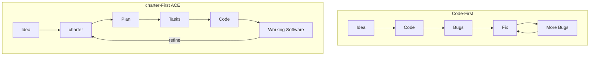

Charter-Orchestrated Engineering (ACE) is a methodology where **charters are the primary artifact**, not code. Code exists to fulfill charters. When there is a conflict between charter and code, the code is wrong.

## Code-First vs. charter-First

| | Code-First | charter-First (ACE) |
|---|---|---|
| **Starting point** | Open editor, start typing | Write a charter |
| **Source of truth** | The codebase | The charter files |
| **AI agent input** | Vague: "build me a todo app" | Structured: requirements, constraints, success criteria |
| **Quality control** | Manual testing | Constitutional governance at every phase gate |
| **When things break** | Debug the code | Check the charter, fix the code to match |
| **Documentation** | Written after (or never) | The charter *is* the documentation |

## The Two Paths

## Three Core Concepts

### 1. charters as Source of Truth

Every project has a `.auro/` directory containing structured charters. These define what the software does, who it is for, and what success looks like. AI agents read these charters. Reviewers check code against these charters. The charters are never generated from code -- code is generated from charters.

### 2. Templates Constrain AI Output

AI agents produce better output when given structure. Auro provides templates for every phase. A template says: "A charter must include these sections." If a section is missing, the charter is incomplete.

### 3. Constitutional Governance Prevents Drift

Every project has a constitution: immutable principles governing all decisions. The constitution is checked at every phase gate. This prevents AI agents from making unauthorized architectural decisions.

## What Auro Provides

An ACE toolkit implementation is the reference execution model for ACE:

- A CLI (`auro`) for initializing projects
- Templates for charters, plans, tasks, and constitutions
- Slash commands (`/auro.charter`, `/auro.plan`, `/auro.tasks`, `/auro.implement`)
- Support for 15+ AI agents including Claude Code, GitHub Copilot, Cursor, and others

## Next Steps

Continue to [Getting Started](/weekend-to-release/guide/getting-started/) to install Auro.
