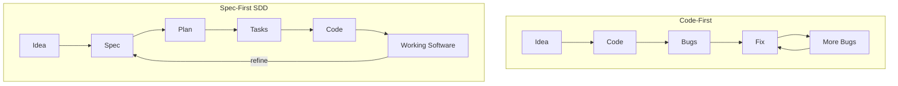

Specification-Driven Development (SDD) is a methodology where **specifications are the primary artifact**, not code. Code exists to fulfill specifications. When there is a conflict between spec and code, the code is wrong.

## Code-First vs. Spec-First

| | Code-First | Spec-First (SDD) |
|---|---|---|
| **Starting point** | Open editor, start typing | Write a specification |
| **Source of truth** | The codebase | The spec files |
| **AI agent input** | Vague: "build me a todo app" | Structured: requirements, constraints, success criteria |
| **Quality control** | Manual testing | Constitutional governance at every phase gate |
| **When things break** | Debug the code | Check the spec, fix the code to match |
| **Documentation** | Written after (or never) | The spec *is* the documentation |

## The Two Paths

## Three Core Concepts

### 1. Specs as Source of Truth

Every project has a `.specify/` directory containing structured specs. These define what the software does, who it is for, and what success looks like. AI agents read these specs. Reviewers check code against these specs. The specs are never generated from code -- code is generated from specs.

### 2. Templates Constrain AI Output

AI agents produce better output when given structure. Spec Kit provides templates for every phase. A template says: "A specification must include these sections." If a section is missing, the spec is incomplete.

### 3. Constitutional Governance Prevents Drift

Every project has a constitution: immutable principles governing all decisions. The constitution is checked at every phase gate. This prevents AI agents from making unauthorized architectural decisions.

## What Spec Kit Provides

[GitHub Spec Kit](https://github.com/github/spec-kit) is the reference implementation of SDD:

- A CLI (`specify`) for initializing projects
- Templates for specs, plans, tasks, and constitutions
- Slash commands (`/speckit.specify`, `/speckit.plan`, `/speckit.tasks`, `/speckit.implement`)
- Support for 15+ AI agents including Claude Code, GitHub Copilot, Cursor, and others

## Next Steps

Continue to [Getting Started](/weekend-to-release/guide/getting-started/) to install Spec Kit.
