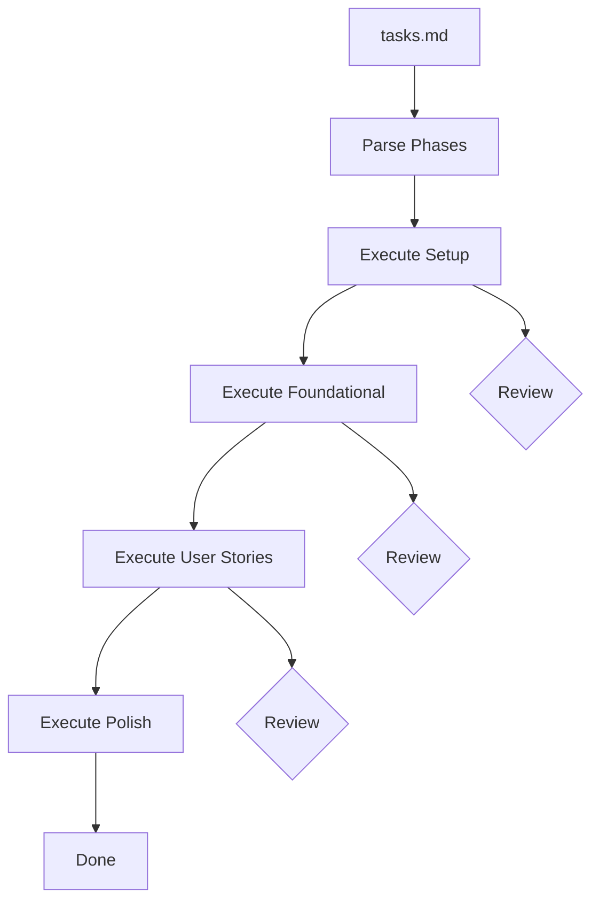

The Implement phase takes your task list and executes it. Run `/speckit.implement` and the agent works through each phase, marking tasks complete as it goes.

## Execution Flow

Between each phase, you review the output. This is the human-in-the-loop checkpoint. The agent does not proceed to the next phase until you approve.

## What Happens

1. The agent reads `tasks.md` and parses phases
2. It initializes the project structure from `plan.md`
3. It executes tasks in order, respecting `[P]` parallel markers
4. Completed tasks are marked `[X]` in the task file
5. On failure, non-parallel tasks halt the phase
6. At each phase boundary, you review before proceeding

## Pages in This Section

- [Agent Workflow](/weekend-to-release/implement/agent-workflow/) -- How AI agents interact with ACE artifacts
- [Agent Guidance File](/weekend-to-release/implement/agent-file/) -- Auto-generated context for your agent
