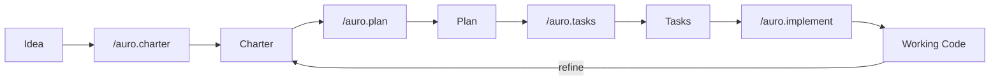

import { Card, CardGrid } from '@astrojs/starlight/components';

## The ACE Workflow

Charter-Orchestrated Engineering breaks building software into four repeatable phases.
Each phase produces an artifact that feeds the next one. Nothing is left to guesswork.

<CardGrid stagger>
  <Card title="Charter" icon="pencil">
    Define what to build with structured charters. User stories, requirements, and success criteria -- all before a single line of code.
  </Card>
  <Card title="Plan" icon="setting">
    Translate charters into technical plans with phase gates and constitutional checks. Every decision traces to a requirement.
  </Card>
  <Card title="Tasks" icon="list-format">
    Break plans into phased, parallel-ready task lists for AI agents. Each task is small, testable, and independent.
  </Card>
  <Card title="Implement" icon="rocket">
    Hand tasks to your AI agent. Review the output, run the tests, ship it.
  </Card>
</CardGrid>

## How It Fits Together

Each phase has a dedicated slash command. You run the command, the AI agent does the work within your constraints, and you review the output before moving on.

The charter is the source of truth at every step. If the code does not match the charter, the code is wrong.

## Get Started

Head to [What is ACE?](/weekend-to-release/guide/what-is-ace/) to understand the methodology, review [Context and Charter Integrity](/weekend-to-release/guide/context-and-charter-integrity/) for scale constraints, or jump to [Getting Started](/weekend-to-release/guide/getting-started/) to install Auro now.
