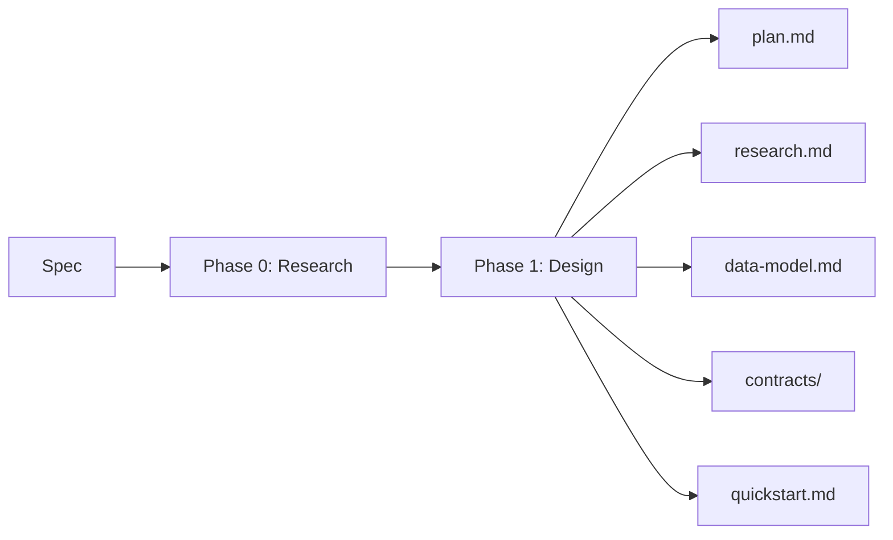

The Plan phase takes your clean specification and produces a technical implementation plan. Run `/speckit.plan` and the agent generates architecture decisions, phase gates, and supporting documents.

## Two Sub-Phases

**Phase 0 -- Research:** Resolves all remaining `[NEEDS CLARIFICATION]` items. Produces `research.md` documenting decisions, rationale, and rejected alternatives.

**Phase 1 -- Design:** Creates the technical architecture. Produces data models, API contracts, and quickstart validation scenarios.

## Constitution Check

Before any design work begins, the plan runs a constitution check. The three gates must pass:

1. **Simplicity Gate** -- Is the architecture minimal?
2. **Anti-Abstraction Gate** -- Are frameworks used directly?
3. **Integration-First Gate** -- Do contracts exist?

If a gate fails, the plan explains why and suggests corrections.

## Pages in This Section

- [Technical Context](/weekend-to-release/plan/technical-context/) -- Documenting your tech stack
- [Phase Gates](/weekend-to-release/plan/phase-gates/) -- Constitutional enforcement
- [Project Structure](/weekend-to-release/plan/project-structure/) -- Layout options
