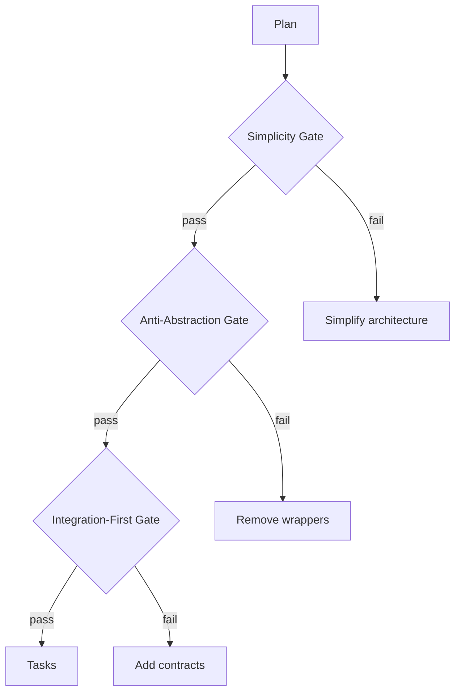

Phase gates are checkpoints where the plan is validated against your constitution. Three gates must pass before implementation begins.

## The Three Gates

### Simplicity Gate (Article VII)

- Maximum 3 projects in the initial structure
- No future-proofing for hypothetical requirements
- If two approaches work, pick the one with fewer moving parts

**Fail example:** A plan proposes 5 microservices for a single-user task manager. Gate fails. Simplify to a monolith.

### Anti-Abstraction Gate (Article VIII)

- Frameworks used directly, not wrapped
- No abstract base classes without 3+ concrete implementations
- Single model per entity, no mapper layers

**Fail example:** A plan includes a `DatabaseAdapter` interface wrapping Drizzle ORM. Gate fails. Use Drizzle directly.

### Integration-First Gate (Article IX)

- API contracts defined before implementation
- Contract tests exist for every integration boundary
- Real databases in tests, not mocks

**Fail example:** A plan has no `contracts/` directory. Gate fails. Define the API before building it.

## Complexity Tracking

When a gate violation is justified, document it:

| Gate | Violation | Justification | Simpler Alternative Rejected Because |
|------|-----------|---------------|--------------------------------------|
| Simplicity | 4 projects | Mobile + API requires separate builds | Single project cannot target both web and mobile |

This table lives in the plan and is reviewed during task generation.
