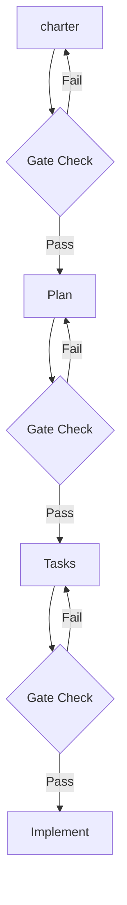

The **constitution** is the governance layer of Charter-Orchestrated Engineering. It defines non-negotiable rules that every charter, plan, and task list must satisfy.

## The Articles

| # | Article | Purpose |
|---|---------|---------|
| I | Library-First | Prefer existing libraries over custom code |
| II | CLI Interface | All tools must have CLI interfaces |
| III | Test-First | Write tests before implementation |
| IV | Integration Testing | Test components together, not just in isolation |
| V | Observability | Build in logging, metrics, and tracing |
| VI | Versioning | Track versions for all artifacts |
| VII | Simplicity | Minimize moving parts and complexity |
| VIII | Anti-Abstraction | Don't abstract until you must |
| IX | Integration-First | Define contracts before building components |

## How Articles Work

Articles act as **phase gates** — checkpoints that charters must pass before moving to the next phase.



Each gate verifies that the output of a phase doesn't violate any constitutional article. For example:

- A plan that introduces an ORM when direct SQL works violates **Article VIII (Anti-Abstraction)**
- A task list with no test tasks violates **Article III (Test-First)**
- A charter requiring 5 microservices for a simple CRUD app violates **Article VII (Simplicity)**

## Key Articles in Detail

Three articles have the most day-to-day impact:

- [Library-First (Article I)](/weekend-to-release/principles/library-first/) — Stop reinventing wheels
- [Test-First (Article III)](/weekend-to-release/principles/test-first/) — Tests drive design, not the reverse
- [Simplicity & Anti-Abstraction (Articles VII + VIII)](/weekend-to-release/principles/simplicity/) — Less is more

## Customizing Your Constitution

The default constitution works for most projects. You can customize it with:

```
/ACE.constitution
```

Common customizations:
- **Relaxing Test-First** for prototypes or spikes
- **Adding domain articles** like "HIPAA Compliance" or "Offline-First"
- **Adjusting complexity thresholds** for larger teams
