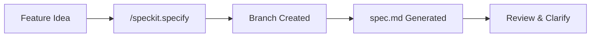

The Specify phase transforms a feature idea into a structured specification. Run `/speckit.specify "your feature description"` and Spec Kit creates a branch, generates a spec from the template, and marks ambiguities.

## What Gets Generated

The spec contains four sections:

1. **User Stories** -- Prioritized P1/P2/P3 scenarios with acceptance criteria
2. **Functional Requirements** -- Numbered FR-001+ requirements with entity definitions
3. **Success Criteria** -- Measurable outcomes SC-001+ in Given/When/Then format
4. **Edge Cases** -- Boundary conditions and error scenarios

Each user story must be independently testable. If you implement only one story, you should still have a viable MVP.

## Key Principle

Ambiguity is marked, not assumed. When the agent encounters something unclear, it writes `[NEEDS CLARIFICATION: question]` instead of guessing. You resolve these with `/speckit.clarify`.

## Pages in This Section

- [User Stories](/weekend-to-release/specify/user-stories/) -- P1/P2/P3 priority system
- [Requirements](/weekend-to-release/specify/requirements/) -- FR numbering and entity modeling
- [Success Criteria](/weekend-to-release/specify/success-criteria/) -- Measurable outcomes
- [Clarify Ambiguities](/weekend-to-release/specify/clarify/) -- Resolving unknowns interactively
