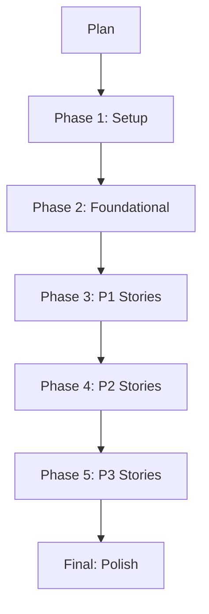

The Tasks phase takes your plan and generates an executable task list. Run `/speckit.tasks` and the agent produces tasks organized by phase with parallel markers and story tags.

## Task Format

```
- [ ] [1] [P] [US1] Create Task model in src/models/task.ts
- [ ] [2] [US1] Create tasks API route in src/routes/tasks.ts
- [ ] [3] [P] [US1] Write integration test for POST /api/tasks
```

- `[ID]` -- Sequential number for tracking
- `[P]` -- Can run in parallel with other `[P]` tasks in the same phase
- `[US#]` -- Maps to a user story

## Phase Decomposition



Each phase must complete before the next begins. Within a phase, `[P]` tasks can run simultaneously.

## Execution Strategies

- **MVP-first** -- Complete only P1 stories, ship, then iterate
- **Incremental** -- Ship after each story phase
- **Parallel team** -- Multiple developers work on `[P]` tasks simultaneously

## Pages in This Section

- [Phased Task Lists](/weekend-to-release/tasks/phased-tasks/) -- Deep dive into phase structure
- [Parallel Markers](/weekend-to-release/tasks/parallel-markers/) -- The `[P]` system
- [Consistency Analysis](/weekend-to-release/tasks/analyze/) -- Checking spec/plan/task alignment
