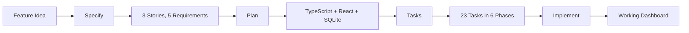

This walkthrough builds a **Home Energy Monitor** -- a web dashboard that tracks electricity usage from smart meters, shows daily/weekly/monthly charts, and sends alerts when usage spikes.

We will walk through all four SDD phases with actual Spec Kit output at each step.

## The Feature

A homeowner wants to:
- See real-time electricity usage on a dashboard
- View historical usage charts (daily, weekly, monthly)
- Get alerts when usage spikes above a threshold

## The Full Flow

## Steps

1. [Step 1: Specify](/weekend-to-release/walkthrough/example-specify/) -- Define user stories and requirements
2. [Step 2: Plan](/weekend-to-release/walkthrough/example-plan/) -- Choose technology and architecture
3. [Step 3: Tasks](/weekend-to-release/walkthrough/example-tasks/) -- Generate the task list
4. [Step 4: Implement](/weekend-to-release/walkthrough/example-implement/) -- Build it with an AI agent
